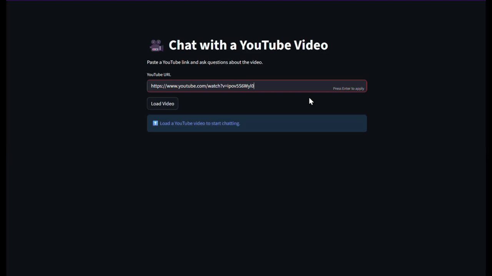

# 🎥 Chat with YouTube Video


An interactive **Streamlit app** that lets you paste a YouTube video URL and:

- 📄 Automatically extract the transcript
- 💬 Ask questions about the video (RAG-based Q&A)
- 📝 Generate a full video summary with one click

Powered by **LangChain**, **FAISS**, and **OpenAI models**.

## Features

- Paste any YouTube video URL
- Automatic transcript extraction
- Retrieval-Augmented Generation (RAG) for accurate answers
- One-click **Summarize** button (full transcript summary)
- Chat-style interface with history
- Embedded video player
- No hallucinations — answers are grounded in the transcript

## 🧠 How It Works (High Level)

```
YouTube URL
↓
Extract Video ID
↓
Fetch Transcript
↓
Chunk & Embed Transcript
↓
Store in FAISS Vector DB
↓
User Question → Retrieve Relevant Chunks → LLM Answer
```

### Two Pipelines:

- **Q&A Mode** → Uses RAG (retriever + LLM)
- **Summary Mode** → Uses full transcript (no retriever)

---

## 🗂️ Project Structure

```
youtube-video-chatbot/
│
├── main.py                     # Streamlit UI
├── rag_pipeline.py             # RAG + summarization logic
│
├── utils/
│   ├── transcript_extractor.py # URL parsing + transcript fetch
│   └── **init**.py
│
├── .env                        # API keys
├── requirements.txt
└── README.md

```

## 🚀 Getting Started

### 1️⃣ Clone the repository

```bash
git clone https://github.com/your-username/youtube-video-chatbot.git
cd youtube-video-chatbot
```

### 2️⃣ Install dependencies

```bash
pip install -r requirements.txt
```

### 3️⃣ Set environment variables

Create a `.env` file:

```env
OPENAI_API_KEY=your_openai_api_key_here
```

### 4️⃣ Run the app

```bash
streamlit run main.py
```

Open your browser at:

```
http://localhost:8501
```
